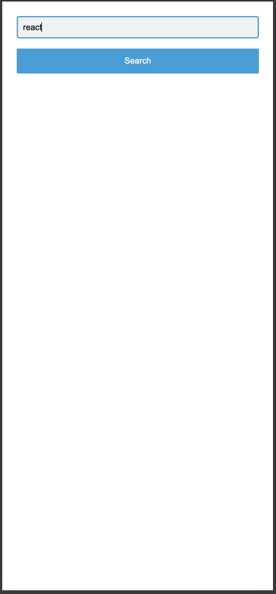
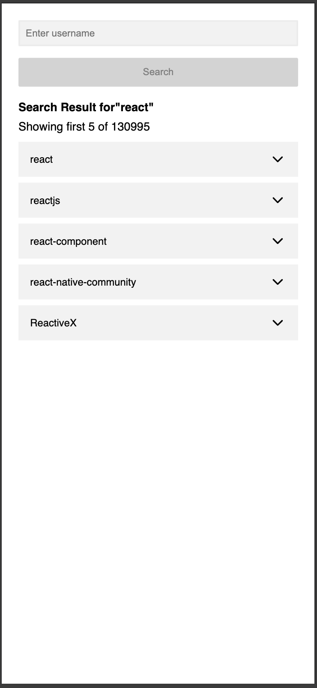
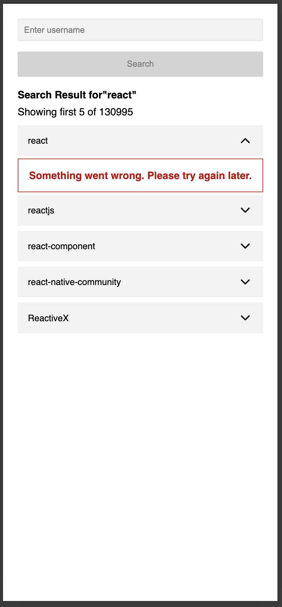
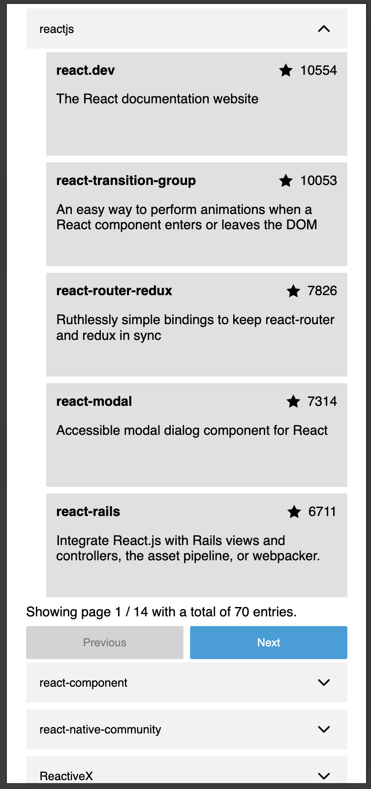

# Github Repository Explorer

This Project is a application task from simple system.

I want to showcase how I structure my codebase with a way bigger project scope in mind.
This is "overkill" for the task itself. Please keep in mind to just solve the task the implementation would be less complex and smaller.

# Getting starting

## cloning and running dev server locally
```shell
git clone https://github.com/atothek1/simple-system-github-explorer 
cd simple-system-github-explorer
npm run i
npm run dev
```

# Project planning

The below plan is NOT a step by step workflow, a lot of steps are overlapping and can take more or less time. It should just help to understand what I have in mind.

| Time | Description |
| --- | --- |
| 1 D | Understanding the task, brainstorming what I want to achieve and what libraries to use, UI Slicedown,  |
| 1/2 D | PoCs of different ideas and libraries i have in mind to use |
| 1/2 D | Project setup and infrastructure |
| 2-3 D | Implementing the Project, writing Test and deployment |
| 1 D | Polishing, Bugfixing & Documentation |

# Decision Log

Here you can find a log of decision of what to do and what NOT to do. As well as some explanations for libraries i have choosen.

## what you can NOT expect

- integrataion of I18N, would bloatup the solution even more, but in big projects a MUST
- usage of a Router like React Router or TanStack Router, same as for I18N, 
- a complex state mangement with Redux, RxJS or a like, have not the need for it,
- End 2 End test with Cypress or playwright

## what you can find:

- basic design system, seperated UI components from domain specific compositional components
- usage of Typescript
- usage of react, swr, react-hook-form, preact-signals, styled-components, vitest, react testing library
- usage of hooks
- seperation of concerns for data fetching, transforming, caching integration and presentation

# Notes:

As the public usage of the github rest api is ratelimited i have not implemented a sophisticated Error handling.
A simple error handling within the fetch logic will expose the rendering of a generic error message component without any further details.

I a professional project error handling and tracing a crucial task and needs to be handled properly. With trace ids, error reporting and error communication.

# UI Slice Down


From the UI slicedown I have identified some UI Design System components as well as some Domain specific components.

This slicedown will not represent a full list of all components just an indidcator to help getting a structure into the UI.

# Missing UI states

During the UI design review and Slicedown I have identified some missing states and potential informations.
please find below a list with solutions i have applied.

- missing inactive Button state: if the search input is empty i would deactivate the button and tint it gray until at least 3 chars entered
- missing empty search result screen/text: i would just show a message like: No result found for "..."
- missing pagination UI for the Repository list, i would add a simple pagination UI by myself
- missing Error Screen, if the search results in an Error I would display: Something unexpected happened, pls try again later.

# Project Sstructure

<pre>
src/
  |-- api/          # contains framework agnostic data fetching and resolving
  | |-- fetcher/     # contains specific data fetchers
  | |-- resolver/   # contains specific response resolver to transform 
  | |                 response data into a clean data model
  |-- components/   # contains all components
  | |-- project/    # contains project specific components
  | |-- ui/         # contains project agnostic somponents, building blocks
  |-- hooks/        # project relevant hooks, wrapping useSWR
  |-- state/        # simple states with preact signals
</pre>


# Workflow

## Git

I have not worked on the project with feature branches and pull requests. In a professional environment I would 
follow the guidelines, and definitly prefer to work with feature branches and Pull request. After successfull CI pipeline and Review i would merge.

## Testing

I have wrote only a small set of test for the more complexer parts. Also they are not 100% complete, I just wanted to show how to write integrate testing into a project.

## Error handling

I have implemented only a very basic error handling without any further information.

# Quick Gallery







# Resources that i have read

- https://www.robinwieruch.de/vitest-react-testing-library/
- https://vitest.dev/


# NPM scripts

## run dev server
```shell
npm run dev
```

## run build
```shell
npm run build
```

## run tests
```shell
npm run test
```

## run linting
```shell
npm run lint
```

## run type checking
```shell
npm run type-check
```

## run lint, test, type.check and build in one command
```shell
npm run ci
```
